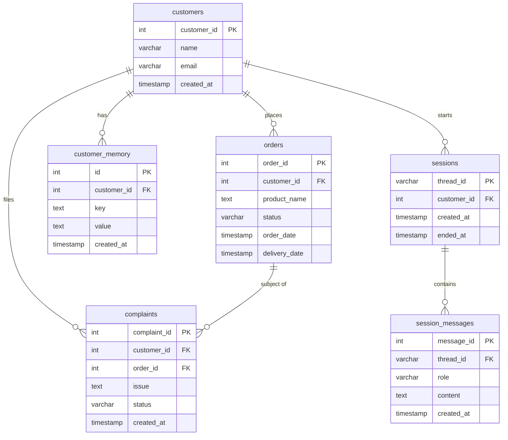

# Entity Relationship Diagram

Source: `project-spec.md` §5 + PRD (Issue #1)

## Tables

### customers
| Column | Type | Constraints |
|--------|------|-------------|
| customer_id | INT | PRIMARY KEY |
| name | VARCHAR(100) | |
| email | VARCHAR(100) | |
| created_at | TIMESTAMP | DEFAULT CURRENT_TIMESTAMP |

### orders
| Column | Type | Constraints |
|--------|------|-------------|
| order_id | INT | PRIMARY KEY |
| customer_id | INT | FK → customers.customer_id |
| product_name | TEXT | |
| status | VARCHAR(50) | e.g. `pending`, `delivered`, `refund_requested` |
| order_date | TIMESTAMP | |
| delivery_date | TIMESTAMP | |

### complaints
| Column | Type | Constraints |
|--------|------|-------------|
| complaint_id | INT | PRIMARY KEY AUTO_INCREMENT |
| customer_id | INT | FK → customers.customer_id |
| order_id | INT | FK → orders.order_id |
| issue | TEXT | |
| status | VARCHAR(50) | |
| created_at | TIMESTAMP | DEFAULT CURRENT_TIMESTAMP |

### customer_memory
| Column | Type | Constraints |
|--------|------|-------------|
| id | INT | PRIMARY KEY AUTO_INCREMENT |
| customer_id | INT | FK → customers.customer_id |
| key | TEXT | |
| value | TEXT | |
| created_at | TIMESTAMP | DEFAULT CURRENT_TIMESTAMP |

### sessions
| Column | Type | Constraints |
|--------|------|-------------|
| thread_id | VARCHAR(100) | PRIMARY KEY |
| customer_id | INT | FK → customers.customer_id |
| created_at | TIMESTAMP | DEFAULT CURRENT_TIMESTAMP |
| ended_at | TIMESTAMP | NULL |

### session_messages
| Column | Type | Constraints |
|--------|------|-------------|
| message_id | INT | PRIMARY KEY AUTO_INCREMENT |
| thread_id | VARCHAR(100) | FK → sessions.thread_id |
| role | VARCHAR(20) | `user`, `assistant`, or `tool` |
| content | TEXT | |
| created_at | TIMESTAMP | DEFAULT CURRENT_TIMESTAMP |

---

## Relationships

```
customers ──< orders          (one customer → many orders)
customers ──< complaints      (one customer → many complaints)
customers ──< customer_memory (one customer → many memory entries)
customers ──< sessions        (one customer → many sessions)
orders    ──< complaints      (one order → many complaints)
sessions  ──< session_messages(one session → many messages)
```

---

## Mermaid ER Diagram



---

## Seed Data (derived from 11 test cases)

| order_id | customer_id | status | Notes |
|----------|-------------|--------|-------|
| 12345 | 1 | `pending` | test 1 — tracking intent |
| 1001 | 1 | `processing` | test 2 — order lookup |
| 5678 | 1 | `delivered` | test 4 — refund eligible |
| 2222 | 1 | `delivered` | test 5 — complaint target |
| 7890 | 1 | `delivered` | test 6 — conditional refund |
| 0000 | — | absent | test 11 — verifier rejects |

`customer_memory` for customer 1 should include at least one entry about a past late delivery (test 10 — repeated pattern detection).

---

## Gaps / Open Questions

1. **`sessions.thread_id` type** — using `VARCHAR(100)` assuming server-generated UUIDs; adjust if LangGraph's SqliteSaver uses a different format.
2. **`orders.status` enum** — valid values are implied by the tools (`pending`, `delivered`, `refund_requested`) but not formally enumerated. Consider using an `ENUM` type.
3. **Foreign key constraints** — the spec omits explicit `FOREIGN KEY` declarations. Add them when creating the schema if referential integrity is desired.