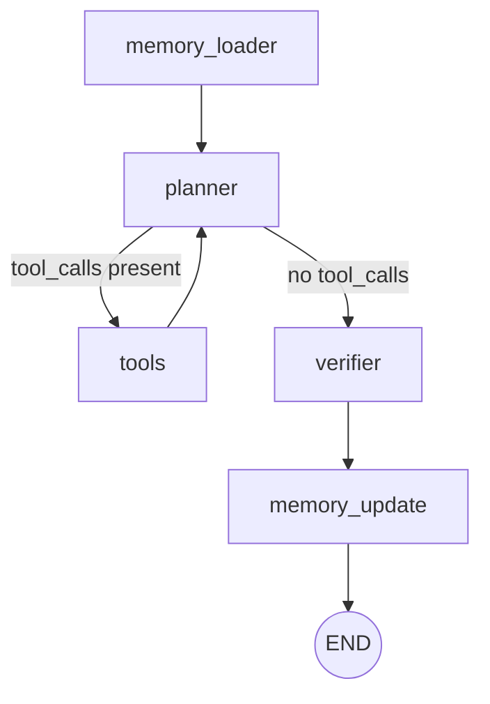
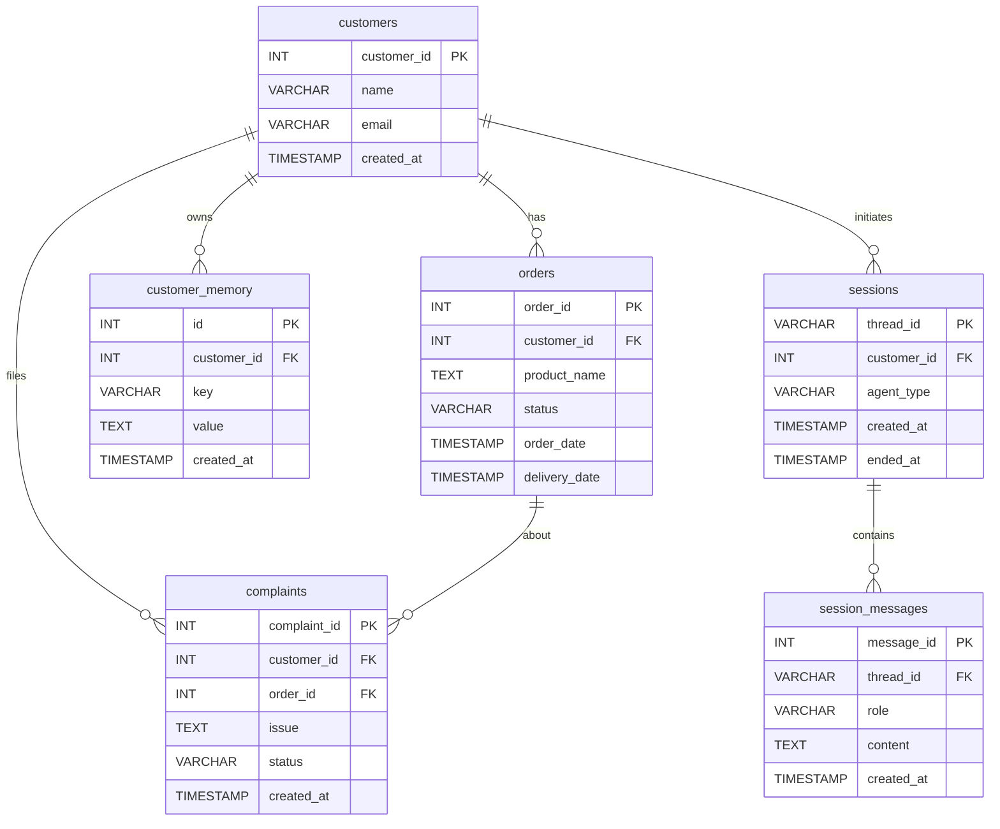

# Report 1 — Intelligent Customer Service Agent

| Field | Value |
|-------|-------|
| **Title** | Intelligent Customer Service Agent using ReAct + LangGraph |
| **Course** | LLM Application Development |
| **Student Name** | *(placeholder)* |
| **Student ID** | *(placeholder)* |
| **Date** | May 2026 |
| **Institution** | National Taiwan University of Science and Technology (NTUST) |

---

## Abstract

This report documents the design and implementation of an Intelligent Customer Service Agent built with the ReAct (Reason + Act) paradigm and LangGraph, a state-graph orchestration framework for large language model (LLM) applications. The system handles customer queries related to order tracking, refund processing, complaint logging, and customer profiling by dynamically selecting and invoking database-backed tools. The agent maintains both short-term conversational memory through a SQLite checkpointer and long-term personalization memory stored in MySQL. A verifier node ensures response correctness by detecting tool errors and preventing hallucinated outputs from reaching the user. The backend is served via FastAPI with Server-Sent Events (SSE) streaming, while a React-based frontend provides a real-time chat interface. This report covers the system architecture, graph design, tool implementation, memory strategy, verification mechanism, and the complete test case suite used for functional validation.

---

## 1. Introduction & Objectives

Customer service operations represent a high-volume, repetitive domain where conversational AI can deliver immediate value. Traditional rule-based chatbots lack the flexibility to handle nuanced multi-step interactions—such as conditional refunds that require verifying order status before proceeding—while naive LLM deployments risk hallucinating data that doesn't exist in the company's records.

This project addresses both limitations by combining structured workflow orchestration (LangGraph) with dynamic tool invocation (ReAct), grounding the agent's actions in real MySQL database operations rather than parametric knowledge alone.

**Objectives:**

1. Understand customer queries spanning orders, complaints, and returns through natural language understanding.
2. Retrieve structured data from a MySQL database via dynamically-selected tool functions.
3. Implement multi-step reasoning using the ReAct pattern, where the agent reasons about intent before acting.
4. Maintain short-term memory (session context across turns) and long-term memory (customer profile and interaction history).
5. Generate accurate, personalized responses grounded in verified tool outputs.
6. Prevent hallucination through a dedicated verifier node that validates tool results before final response delivery.

---

## 2. Background / Related Work

### 2.1 ReAct: Reason + Act

The ReAct paradigm, introduced by Yao et al. (2023), interleaves reasoning traces with action execution in LLM-based agents. Rather than generating a final answer in a single pass, a ReAct agent follows an iterative loop: it reasons about the current state, selects an action (tool call), observes the result, and reasons again until the task is complete. This approach grounds LLM outputs in external data sources, significantly reducing hallucination compared to chain-of-thought prompting alone. In our system, the planner node implements ReAct by binding tools to the LLM and allowing it to emit tool-call decisions interleaved with natural language reasoning.

### 2.2 LangGraph StateGraph Abstraction

LangGraph provides a StateGraph abstraction for orchestrating multi-node LLM workflows as directed graphs. Each node is a function that receives and returns a typed state dictionary; edges (including conditional edges) define the execution flow. Key capabilities include:

- **Typed state propagation**: An `AgentState` TypedDict flows through all nodes, accumulating messages, memory context, and verification results.
- **Conditional routing**: The `tools_condition` utility inspects the LLM's output for tool-call requests and routes to the tool-execution node or continues to verification.
- **Built-in checkpointing**: `SqliteSaver` or `AsyncSqliteSaver` persist the full conversation state, enabling multi-turn sessions without application-level state management.
- **Recursion control**: A configurable recursion limit prevents infinite tool-calling loops.

### 2.3 Short-Term vs Long-Term Memory in Conversational AI

Conversational AI systems require two distinct memory horizons:

- **Short-term memory (STM)** captures the current session's dialogue history—prior user messages, assistant responses, and tool outputs. STM enables coreference resolution (e.g., "cancel *it*" referring to a previously mentioned order) and multi-turn reasoning. In LangGraph, STM is handled natively by the checkpointer, which persists the full message list between turns.

- **Long-term memory (LTM)** retains information across sessions: customer preferences, interaction history, complaint patterns, and derived behavioral signals. LTM enables personalization—for example, detecting that a customer has experienced repeated late deliveries and proactively acknowledging the pattern. In our system, LTM is stored in a dedicated `customer_memory` MySQL table with key-value pairs per customer, loaded at the start of each turn and updated at the end.

The combination of STM and LTM allows the agent to be both contextually aware within a conversation and personally aware across the customer's entire interaction history.

---

## 3. System Architecture

### 3.1 LangGraph Node Pipeline

The customer service agent is implemented as a five-node directed graph. The following diagram shows the complete node pipeline and execution flow:



**Node responsibilities:**

| Node | Responsibility |
|------|---------------|
| `memory_loader` | Loads long-term memory and complaint history from MySQL into state |
| `planner` | LLM reasoning node with bound tools; implements ReAct loop |
| `tools` | Executes tool functions selected by the planner (via LangGraph `ToolNode`) |
| `verifier` | Validates tool results; overrides LLM response if errors are unacknowledged |
| `memory_update` | Persists interaction summary to long-term memory |

The planner-to-tools loop can iterate multiple times (up to the recursion limit of 50) to handle multi-step reasoning tasks such as "refund order 7890 if delivered," which requires an order lookup followed by a conditional refund.

### 3.2 Frontend Integration

The React frontend communicates with the agent graph via a `POST /chat/stream` endpoint that returns Server-Sent Events (SSE). Each graph node emits structured events (`memory_loaded`, `planner_start`, `planner_result`, `tool_start`, `tool_result`, `verifier_result`, `memory_updated`, `response_token`, `response_end`) that the frontend renders in real-time, providing transparency into the agent's reasoning process. The chat interface supports customer selection, session management, and a process timeline panel that visualizes each step of the agent's execution.

---

## 4. Implementation

### 4.1 AgentState TypedDict Design

The shared state flowing through all graph nodes is defined as:

```python
from typing import Annotated, TypedDict
from langgraph.graph.message import add_messages


class AgentState(TypedDict):
    messages:       Annotated[list, add_messages]
    customer_id:    int | None
    memory_context: list[dict] | None
    tool_results:   list[dict] | None
    verification:   dict | None
```

The `messages` field uses LangGraph's `add_messages` annotation, which appends new messages rather than replacing the list—this accumulates the full conversation history. The `memory_context` carries loaded long-term memory entries for the planner's system prompt. The `verification` field holds the verifier's output for downstream SSE emission.

### 4.2 Graph Compilation with SqliteSaver Checkpointer

The graph is compiled with a SQLite-based checkpointer for persistent multi-turn sessions:

```python
import sqlite3
from langgraph.graph import StateGraph, END
from langgraph.checkpoint.sqlite import SqliteSaver
from langgraph.prebuilt import ToolNode, tools_condition

from graph.shared.state import AgentState
from graph.customer_service.memory_loader import memory_loader
from graph.customer_service.planner import planner
from graph.customer_service.tools import (
    order_lookup, customer_profile, refund, complaint_logger, memory_tool,
)
from graph.shared.verifier import verifier
from graph.customer_service.memory_update import memory_update

CHECKPOINT_DB_PATH = "checkpoints.db"
RECURSION_LIMIT = 50

_TOOLS = [order_lookup, customer_profile, refund, complaint_logger, memory_tool]

_conn = sqlite3.connect(CHECKPOINT_DB_PATH, check_same_thread=False)
_checkpointer = SqliteSaver(_conn)


def create_builder() -> StateGraph:
    builder = StateGraph(AgentState)
    builder.add_node("memory_loader", memory_loader)
    builder.add_node("planner", planner)
    builder.add_node("tools", ToolNode(_TOOLS))
    builder.add_node("verifier", verifier)
    builder.add_node("memory_update", memory_update)

    builder.set_entry_point("memory_loader")
    builder.add_edge("memory_loader", "planner")
    builder.add_conditional_edges(
        "planner", tools_condition, {"tools": "tools", END: "verifier"}
    )
    builder.add_edge("tools", "planner")
    builder.add_edge("verifier", "memory_update")
    builder.add_edge("memory_update", END)
    return builder


def compile_graph(checkpointer):
    return (
        create_builder()
        .compile(checkpointer=checkpointer)
        .with_config({"recursion_limit": RECURSION_LIMIT})
    )
```

The `tools_condition` function from LangGraph's prebuilt utilities inspects the last AI message for tool-call requests. If present, execution routes to the `tools` node; otherwise, it proceeds to `verifier`. This implements the ReAct loop where the planner iteratively calls tools until it's ready to produce a final response.

### 4.3 Full System Prompt

The planner constructs a dynamic system prompt that incorporates loaded long-term memory:

```python
from langchain_core.messages import SystemMessage
from langchain_core.runnables import RunnableConfig

from graph.shared.state import AgentState
from graph.customer_service.tools import order_lookup, customer_profile, refund, complaint_logger, memory_tool
from llm_factory import create_llm

_TOOLS = [order_lookup, customer_profile, refund, complaint_logger, memory_tool]


def build_system_prompt(memory_context: list[dict] | None) -> str:
    lines = [
        "You are a helpful customer service agent.",
        "Think aloud before calling any tool — state your reasoning first, then act.",
    ]

    if memory_context:
        memory_entries = [e for e in memory_context if e.get("type") == "memory"]
        complaint_entries = [e for e in memory_context if e.get("type") == "complaint"]

        if memory_entries:
            lines.append("\nCustomer History:")
            for e in memory_entries:
                lines.append(f"- {e['key']}: {e['value']}")

        if complaint_entries:
            lines.append("\nComplaint History:")
            for e in complaint_entries:
                lines.append(f"- Order {e['order_id']}: {e['issue']} (status: {e['status']})")

    return "\n".join(lines)


def planner(state: AgentState, config: RunnableConfig) -> dict:
    configurable = config.get("configurable", {}) if config else {}
    provider = configurable.get("provider", None)
    model = configurable.get("model", None)

    system_prompt = build_system_prompt(state.get("memory_context"))
    llm_with_tools = create_llm(provider=provider, model=model).bind_tools(_TOOLS)
    messages = [SystemMessage(content=system_prompt)] + list(state["messages"])
    response = llm_with_tools.invoke(messages, config=config)
    return {"messages": [response]}
```

The system prompt instructs the LLM to reason before acting and dynamically injects customer history and complaint records loaded by the `memory_loader` node. This enables personalization—for example, when a customer says "my order is late again," the LLM sees their `late_delivery_pattern` memory entry and acknowledges the repeated issue.

### 4.4 Tools

#### 4.4.1 Full Tool Example: `order_lookup`

```python
from langchain_core.tools import tool
from langchain_core.runnables import RunnableConfig

from db.connection import get_connection


@tool
def order_lookup(order_id: int, config: RunnableConfig) -> dict:
    """Look up order details for the current customer by order ID."""
    customer_id = config["configurable"]["customer_id"]
    conn = get_connection()
    try:
        cursor = conn.cursor(dictionary=True)
        cursor.execute(
            "SELECT order_id, customer_id, product_name, status, order_date, delivery_date "
            "FROM orders WHERE order_id = %s AND customer_id = %s",
            (order_id, customer_id),
        )
        row = cursor.fetchone()
        if row is None:
            return {"error": f"Order {order_id} not found or not accessible."}
        return dict(row)
    finally:
        conn.close()
```

This tool demonstrates the implementation pattern shared across all tools:
1. The `@tool` decorator registers the function with LangGraph's tool-calling infrastructure.
2. `RunnableConfig` provides the authenticated `customer_id` from the session, ensuring data isolation.
3. A MySQL connection is obtained, a parameterized query is executed, and results are returned as a dictionary.
4. Error cases return an `{"error": ...}` dict that the verifier can detect.

#### 4.4.2 Tool Summary Table

| Tool Name | Purpose | SQL Operation | Parameters |
|-----------|---------|---------------|------------|
| `customer_profile` | Retrieve the current customer's profile information | `SELECT` from `customers` | *(none — uses customer_id from config)* |
| `refund` | Initiate a refund for a delivered order | `SELECT` + `UPDATE` on `orders` (sets status to `refund_requested`) | `order_id: int` |
| `complaint_logger` | Log a new complaint about an order | `SELECT` from `orders` (ownership check) + `INSERT` into `complaints` | `order_id: int`, `issue: str` |
| `memory_tool` | Read or write long-term customer memory | `SELECT` or `INSERT ... ON DUPLICATE KEY UPDATE` on `customer_memory` | `action: str`, `key: str` (optional), `value: str` (optional) |

All tools enforce customer-level data isolation by validating ownership before performing operations. The `refund` tool additionally enforces business logic (only delivered orders are eligible). The `complaint_logger` requires order verification before accepting a complaint.

### 4.5 Memory Design

#### 4.5.1 Short-Term Memory (SQLite Checkpointer)

Short-term memory is handled by LangGraph's `SqliteSaver` checkpointer, which persists the full `AgentState`—including all messages—to a SQLite database keyed by `thread_id`. This enables:

- Multi-turn conversations where the agent remembers prior messages in the same session.
- Coreference resolution (e.g., "cancel *it*" after discussing an order).
- Resumption of interrupted sessions.

No application code is needed to manage STM; it is an inherent capability of the checkpointed graph.

#### 4.5.2 Long-Term Memory (MySQL `customer_memory` Table)

Long-term memory is stored in the `customer_memory` table with a unique constraint on `(customer_id, key)`, enabling upsert semantics. The memory lifecycle:

1. **Load** (`memory_loader` node): At the start of each turn, all memory entries and complaint records for the current customer are loaded and placed into `state["memory_context"]`.
2. **Inject** (`planner` node): The `build_system_prompt` function formats memory entries into the system prompt, making them visible to the LLM.
3. **Update** (`memory_update` node): After the response is generated, a summary of the interaction is persisted as the `last_interaction_summary` key.
4. **Explicit write** (`memory_tool`): The LLM can also explicitly write memory entries when the user says things like "remember I prefer refunds over store credit."

### 4.6 Database Schema

The following ER diagram shows the MySQL schema used by the system:



### 4.7 Verifier Node

The verifier node acts as a post-processing quality gate that prevents hallucinated or erroneous responses from reaching the user. Its logic:

```python
def verifier(state: AgentState) -> dict:
    messages = state.get("messages") or []

    tool_messages = [m for m in messages if isinstance(m, ToolMessage)]
    if not tool_messages:
        return {
            "verification": {"valid": True, "checks": ["no tool calls"], "override_message": None},
            "tool_results": [],
        }

    parsed_results = [_parse_tool_content(tm) for tm in tool_messages]

    errors = [c["error"] for c in parsed_results if "error" in c]
    empty_lookups = [
        f"empty result for '{k}'"
        for c in parsed_results
        for k, v in c.items()
        if isinstance(v, list) and len(v) == 0
    ]
    all_issues = errors + empty_lookups

    if not all_issues:
        return {
            "verification": {"valid": True, "checks": ["all checks passed"], "override_message": None},
            "tool_results": parsed_results,
        }

    # Check if LLM already acknowledged the error
    last_ai = next((m for m in reversed(messages) if isinstance(m, AIMessage)), None)
    ai_content = (last_ai.content or "").lower() if last_ai else ""
    error_keywords = ["not found", "error", "cannot", "could not", "unable", "invalid", ...]
    llm_acknowledged = any(kw in ai_content for kw in error_keywords)

    override = None if llm_acknowledged else f"I could not complete that request: {all_issues[0]}"
    # If override is needed, inject a corrective AIMessage
    ...
```

The verifier detects three categories of issues:
1. **Tool errors**: Explicit `{"error": ...}` returns from tool functions (e.g., order not found).
2. **MCP errors**: Permission denied, authentication failures, rate limits.
3. **Empty lookups**: Tool results with empty lists indicating no data.

If the LLM's response already acknowledges the error (checked via keyword matching), no override is applied. Otherwise, the verifier injects a corrective `AIMessage` that transparently communicates the failure to the user.

### 4.8 LLM Factory — Multi-Provider Support

The system supports two LLM providers, selectable per-request:

```python
from langchain_openai import ChatOpenAI
from langchain_ollama import ChatOllama
from config import get_config


def create_llm(provider: str | None = None, model: str | None = None) -> ChatOpenAI | ChatOllama:
    cfg = get_config()
    resolved_provider = provider or "openrouter"

    if resolved_provider == "openrouter":
        return ChatOpenAI(
            base_url=cfg.LLM_PROVIDER_URL,
            model=cfg.DEFAULT_MODEL,
            api_key=cfg.OPENROUTER_API_KEY,
            max_tokens=int(os.environ.get("LLM_MAX_TOKENS", "4096")),
        )
    elif resolved_provider == "ollama":
        return ChatOllama(
            base_url=cfg.OLLAMA_BASE_URL,
            model=cfg.OLLAMA_DEFAULT_MODEL,
        )
    else:
        raise ValueError(f"Unknown provider: {resolved_provider!r}.")
```

| Provider | LangChain Class | Use Case |
|----------|-----------------|----------|
| OpenRouter | `ChatOpenAI` | Cloud-hosted models (default); access to GPT-4, Claude, etc. via unified API |
| Ollama | `ChatOllama` | Local inference; requires tool-calling capable models (e.g., `qwen3:8b`, `llama3.1:8b`) |

The provider is passed through `RunnableConfig["configurable"]` from the HTTP request, through the graph, and into the planner node, allowing different users or sessions to use different models without code changes.

---

## 5. Test Cases

The following test cases validate each functional area of the customer service agent. They are executed as customer Ahmad Rifqi (`customer_id = 1`).

| # | Function | Test Query | Expected Behavior |
|---|---|---|---|
| 1 | Intent Parsing | Where is my order 12345? | Extract intent = tracking, order_id = 12345 |
| 2 | OrderLookupTool | Check status of order 1001 | Query `orders` table; return status = processing |
| 3 | CustomerProfileTool | Show my profile | Return Ahmad Rifqi's name and email |
| 4 | RefundTool | Refund order 5678 | Set status = refund_requested (order was delivered) |
| 5 | ComplaintLoggerTool | I want to complain about order 2222 | Insert new complaint row for order 2222 |
| 6 | Multi-step Reasoning | Refund order 7890 if delivered | Lookup → confirm delivered → then refund |
| 7 | Short-Term Memory (STM) | Cancel it *(after asking about order 12345)* | Resolve "it" from previous turn → cancel order 12345 |
| 8 | Long-Term Memory (Read) | What issues have I had before? | Retrieve `delivery_history_*` and `complaint_count` from `customer_memory` |
| 9 | Long-Term Memory (Write) | Remember I prefer refunds over store credit | Upsert preference key into `customer_memory` |
| 10 | Personalization | My order is late again | Detect `late_delivery_pattern` in LTM → acknowledge repeated issue |
| 11 | Verifier | Refund order 0000 | Reject — order 0000 does not exist |

**Note:** Detailed test results with screenshots and agent process traces are provided in Appendix A (attached separately).

---

## 6. Conclusion

This project demonstrates that combining LangGraph's structured workflow orchestration with the ReAct reasoning paradigm produces a customer service agent that is both capable and reliable. The five-node graph architecture—memory loader, planner, tools, verifier, and memory update—provides clear separation of concerns while maintaining the flexibility of LLM-driven tool selection.

Key achievements:

- **Grounded responses**: All factual claims are backed by MySQL queries rather than parametric knowledge, eliminating the class of hallucinations where an LLM fabricates order statuses or customer details.
- **Multi-step reasoning**: The ReAct loop handles conditional operations (e.g., "refund if delivered") through iterative tool calls, each informed by the results of the previous step.
- **Dual memory**: Short-term memory (via checkpointer) enables natural multi-turn conversations, while long-term memory (via MySQL) enables personalization that persists across sessions.
- **Verification**: The verifier node provides a safety net that catches tool errors the LLM might otherwise gloss over, ensuring users receive accurate information about failures.
- **Provider flexibility**: The LLM factory pattern allows seamless switching between cloud (OpenRouter) and local (Ollama) inference without architectural changes.

The system serves as a practical demonstration that LLM agents can be made both powerful and trustworthy when their actions are constrained through structured workflows and verified against ground-truth data sources.

---

## Appendix A — Test Results

See attached test results document.
