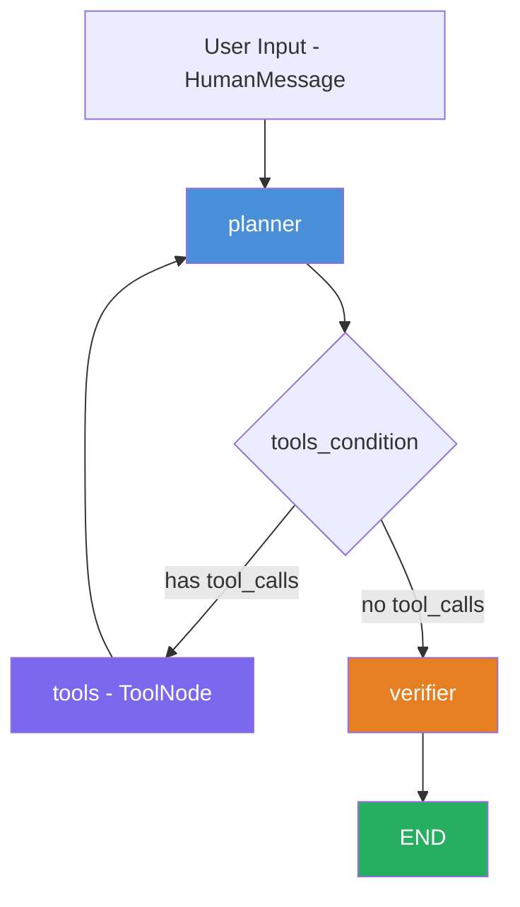
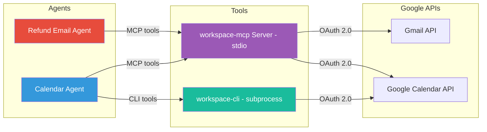

# Report 2 — AI Workspace Agent Suite

| Field | Value |
|---|---|
| **Title** | AI Workspace Agent Suite: Autonomous Google Workspace Agents Using ReAct, LangGraph, and MCP |
| **Course** | LLM Application Development |
| **Student Name** | *(fill in)* |
| **Student ID** | *(fill in)* |
| **Date** | May 2026 |
| **Institution** | National Taiwan University of Science and Technology (NTUST) |

---

## Abstract

This report documents the design and implementation of the AI Workspace Agent Suite, a system of two autonomous AI agents that connect to a live Google Workspace account and perform real-world business tasks through natural language. The **Refund Email Agent** monitors a Gmail inbox, classifies customer emails by intent (refund request, return request, complaint, or unrelated), and sends professional threaded replies without human intervention. The **Calendar Agent** answers natural-language questions about a Google Calendar, creates and modifies events, checks free time slots, and sends RSVPs. Both agents share a common architecture: the ReAct (Reasoning + Acting) pattern implemented with LangGraph `StateGraph`, powered by an LLM via LangChain, and connected to Google Workspace through the open-source `google_workspace_mcp` server over stdio transport. The Calendar Agent adds a second tool surface — lightweight `workspace-cli` subprocess calls for fast read-only queries. This report covers the system architecture, the implementation of each agent, the MCP client integration layer, and the test case design used to validate the system.

---

## 1. Introduction and Objectives

Modern enterprises rely heavily on email and calendar workflows that consume significant human attention. Responding to customer refund requests, scheduling meetings, and managing calendar events are repetitive tasks that follow well-defined patterns — making them prime candidates for AI automation.

This project aims to demonstrate that a small number of well-structured AI agents, built on open standards and connected to real productivity APIs, can reliably automate these workflows. The specific objectives are:

1. **Build two autonomous agents** — one for Gmail-based customer service (refund/return email processing) and one for Google Calendar management — using a shared ReAct architecture.
2. **Implement the ReAct pattern** using LangGraph's `StateGraph` abstraction, enabling the agents to reason about multi-step tasks, call tools, observe results, and iterate until the task is complete.
3. **Connect agents to Google Workspace** through the Model Context Protocol (MCP), an open standard for AI tool integration, using secure local stdio transport that keeps data on-device.
4. **Demonstrate a dual-tool strategy** in the Calendar Agent, combining fast CLI subprocess calls for read operations with full MCP tool calls for write operations.
5. **Validate correctness** through structured test cases covering each agent's functional requirements, tool selection logic, and shared infrastructure behavior.

The system is implemented as a full-stack application with a FastAPI backend hosting the LangGraph agents and a React frontend for user interaction. This report focuses on the backend agent architecture and implementation — the workspace agent modules that extend the base customer service platform.

---

## 2. Background and Related Work

### 2.1 The ReAct Pattern

The ReAct (Reasoning + Acting) paradigm, introduced by Yao et al. (2023), interleaves chain-of-thought reasoning with concrete actions in an iterative loop. Unlike pure chain-of-thought prompting, which generates reasoning traces without external grounding, ReAct agents can call tools, observe the results, and adjust their reasoning accordingly. This closed-loop design enables agents to handle multi-step tasks where the correct sequence of actions depends on intermediate results — for example, searching an inbox, reading specific emails based on search results, classifying their content, and composing replies.

In our implementation, the ReAct loop is realized as a cycle between two graph nodes: `planner` (the LLM reasoning step) and `tools` (the action execution step). The loop continues until the LLM produces a response with no tool calls, at which point the graph terminates.

### 2.2 LangGraph StateGraph

LangGraph provides a directed-graph abstraction for building stateful, multi-step agent workflows. Its `StateGraph` class allows developers to define nodes (Python functions), edges (transitions between nodes), and conditional edges (routing decisions based on state). The key abstraction that enables ReAct is the `add_messages` reducer on the state's `messages` field: rather than replacing the message list on each step, new messages are appended, preserving the full conversation history — including all prior tool calls and results — across every iteration of the loop.

LangGraph also provides the `ToolNode` prebuilt node, which automatically dispatches structured tool call JSON from the LLM to the correct tool implementation and wraps results in `ToolMessage` objects. Combined with `tools_condition` (a prebuilt conditional edge function), these components reduce the implementation of a ReAct agent to a handful of lines defining the graph topology.

### 2.3 Model Context Protocol (MCP)

The Model Context Protocol (MCP) is an open standard (now under the Linux Foundation) that defines a JSON-RPC interface for AI models to discover, invoke, and receive results from external tools. MCP decouples the tool-calling LLM from the tool implementation: the LLM emits structured tool calls, the MCP client forwards them to an MCP server, and the server translates them into API calls (in our case, Google Workspace APIs). This separation means the same agent code works with any MCP-compatible tool server without modification.

In this project, we use the `google_workspace_mcp` server, an open-source MCP server that exposes Gmail and Google Calendar operations as MCP tools. The server handles OAuth 2.0 authentication, API pagination, and error handling, presenting a clean tool interface to the agent.

### 2.4 Stdio Transport — Local-First Security

MCP supports multiple transport mechanisms. We use **stdio transport**, where the MCP server runs as a local subprocess communicating via stdin/stdout pipes. This design ensures that all data — email content, calendar events, OAuth tokens — remains on the local machine. No network ports are opened, no data passes through third-party intermediaries, and the server's lifecycle is tied to the agent's process. This is a deliberate security choice: workspace data is sensitive, and stdio transport eliminates an entire class of network-based attack vectors.

---

## 3. System Architecture

### 3.1 Shared ReAct Loop

Both agents share an identical three-node graph topology. The `planner` node invokes the LLM with the full message history. If the LLM emits tool calls, the `tools_condition` conditional edge routes to the `tools` node, which executes them and appends `ToolMessage` results to the state. Control then returns to `planner` for the next reasoning step. When the LLM produces a response with no tool calls, the edge routes to `verifier` for a post-response quality check, and then to `END`.



A single user request may trigger 5–15 iterations of the `planner → tools` loop before the agent produces its final answer. The `verifier` node inspects tool results for errors (permission denied, rate limits, empty lookups) and, if the LLM's final response did not acknowledge the error, overrides it with a clear failure message.

### 3.2 Top-Level System Architecture

The two agents share the MCP client infrastructure but operate on different Google API surfaces. The Calendar Agent additionally has access to CLI subprocess tools for fast read-only queries.



### 3.3 Frontend Access

The workspace agents are accessed through the same React frontend that hosts the base customer service agent. The frontend provides a chat interface where users can select the agent type (customer service, refund email, or calendar) and interact via natural language. The backend's `/chat/stream` SSE endpoint routes requests to the appropriate LangGraph agent based on the request payload. For the Refund Email Agent, users can also trigger the fully autonomous batch processing mode through the chat interface.

---

## 4. Implementation — Refund Email Agent

The Refund Email Agent is implemented in `backend/graph/refund_email/` and consists of two modules: `graph.py` (graph construction) and `planner.py` (LLM node with system prompt).

### 4.1 Automated Workflow

The agent follows a six-step workflow when triggered in batch mode:

```text
SEARCH inbox → READ each email → CLASSIFY intent →
DRAFT reply from template → SEND threaded reply → REPORT summary
```

Each step corresponds to one or more tool calls within the ReAct loop. A batch run processing three emails typically requires 10–15 tool calls across multiple loop iterations.

### 4.2 Gmail MCP Tool Inventory

The agent uses Gmail-specific MCP tools loaded from the `workspace-mcp` server and filtered by the `McpClientManager`. The following table summarizes the available tools:

| Tool Name | Purpose | Key Parameters |
|---|---|---|
| `search_gmail_messages` | Search inbox with Gmail query operators | `query`, `max_results` |
| `get_gmail_message_content` | Read full body and metadata of one email | `message_id` |
| `get_gmail_messages_content_batch` | Fetch up to 25 emails in one call | `message_ids`, `format` |
| `send_gmail_message` | Send or reply to an email (threaded) | `to`, `subject`, `body`, `thread_id` |
| `create_gmail_draft` | Save a draft for human review | `to`, `subject`, `body` |
| `get_gmail_thread` | Read full conversation thread | `thread_id` |
| `list_gmail_labels` | List all Gmail labels and folders | *(none)* |

### 4.3 System Prompt

The system prompt defines the agent's identity, workflow rules, classification guide, and behavioral constraints. It is prepended to every LLM call as a `SystemMessage`. The full prompt, extracted from `backend/graph/refund_email/planner.py`:

```python
SYSTEM_PROMPT = f"""You are a Refund Email Agent. You read, classify, and reply to customer
refund and return emails in a Gmail inbox.
The authenticated Gmail account is {user_email}. Always pass this exact email when tools
require an email parameter.

## Batch Workflow (use when asked to process all refund emails)
Follow these steps in order, exactly once per batch command:
1. SEARCH — use search_gmail to find unread emails matching refund or return criteria
2. READ — use get_message to retrieve the full body of each email found
3. CLASSIFY — categorize each email as one of: REFUND_REQUEST, RETURN_REQUEST,
   COMPLAINT, or OTHER
4. DRAFT — compose a professional reply appropriate to the classification
5. SEND — use send_reply or send_message to send the drafted reply
6. REPORT — summarize what was processed: how many emails, their classifications,
   and actions taken

After delivering the REPORT, stop. Do not start another SEARCH unless the user sends
a new request.

## Interactive Queries
For specific questions (e.g. "What refund emails came in today?"), use the same tools
but follow the user's request directly rather than the full batch sequence. Return your
answer once and stop.

## Classification Guide
- REFUND_REQUEST: customer explicitly requests a monetary refund
- RETURN_REQUEST: customer wants to return or exchange an item
- COMPLAINT: customer expresses dissatisfaction without requesting a specific action
- OTHER: anything that does not fit the above categories

Always think aloud before calling a tool — state your reasoning first, then act."""
```

The prompt enforces several key constraints: the agent must follow the six-step workflow in sequence, must not restart the search loop after reporting, must classify each email into exactly one of four categories, and must reason aloud before each tool call. The `user_email` variable is injected from the `WORKSPACE_USER_EMAIL` environment variable to ensure the agent always uses the correct authenticated account.

### 4.4 Graph Construction

The graph is built in `backend/graph/refund_email/graph.py`. The `create_builder` function assembles the three-node topology:

```python
import sqlite3
from contextlib import AbstractAsyncContextManager

from langgraph.graph import StateGraph, END
from langgraph.checkpoint.sqlite import SqliteSaver
from langgraph.checkpoint.sqlite.aio import AsyncSqliteSaver
from langgraph.prebuilt import ToolNode, tools_condition

from graph.shared.state import AgentState
from graph.shared.verifier import verifier
from graph.refund_email.planner import make_planner

CHECKPOINT_DB_PATH = "checkpoints_refund_email.db"
RECURSION_LIMIT = 50

_async_checkpointer_cm: AbstractAsyncContextManager[AsyncSqliteSaver] | None = None
_async_graph = None


def create_builder(tools: list) -> StateGraph:
    builder = StateGraph(AgentState)
    builder.add_node("planner", make_planner(tools))
    builder.add_node("tools", ToolNode(tools))
    builder.add_node("verifier", verifier)

    builder.set_entry_point("planner")
    builder.add_conditional_edges(
        "planner", tools_condition, {"tools": "tools", END: "verifier"}
    )
    builder.add_edge("tools", "planner")
    builder.add_edge("verifier", END)
    return builder


def compile_graph(tools: list, checkpointer):
    return (
        create_builder(tools)
        .compile(checkpointer=checkpointer)
        .with_config({"recursion_limit": RECURSION_LIMIT})
    )


async def get_async_graph():
    global _async_checkpointer_cm, _async_graph

    if _async_graph is None:
        from graph.mcp_client import mcp_manager
        tools = mcp_manager.get_tools("refund_email")

        _async_checkpointer_cm = AsyncSqliteSaver.from_conn_string(CHECKPOINT_DB_PATH)
        checkpointer = await _async_checkpointer_cm.__aenter__()
        _async_graph = compile_graph(tools, checkpointer)

    return _async_graph


async def close_async_graph() -> None:
    global _async_checkpointer_cm, _async_graph

    if _async_checkpointer_cm is not None:
        await _async_checkpointer_cm.__aexit__(None, None, None)
        _async_checkpointer_cm = None
        _async_graph = None
```

Key design decisions in this code:

- **`RECURSION_LIMIT = 50`**: batch refund processing can legitimately loop across multiple emails, so the limit is set high enough to accommodate search-read-classify-reply cycles for a full inbox without masking infinite loops.
- **`AsyncSqliteSaver`**: provides persistent checkpointing so the agent's state survives process restarts. Each agent type uses its own checkpoint database file.
- **`verifier` node**: inserted between the LLM's final response and `END` to catch tool errors that the LLM may not have acknowledged in its response.
- **Lazy initialization**: `get_async_graph()` creates the graph on first call and caches it, avoiding repeated MCP tool loading on subsequent requests.

### 4.5 Planner Node

The planner node is constructed by `make_planner(tools)`, which returns a closure with access to the tool-bound LLM:

```python
def make_planner(tools: list):
    def planner(state: AgentState, config: RunnableConfig) -> dict:
        configurable = config.get("configurable", {}) if config else {}
        provider = configurable.get("provider", None)
        model = configurable.get("model", None)

        llm_with_tools = create_llm(provider=provider, model=model).bind_tools(tools)
        messages = [SystemMessage(content=build_system_prompt())] + list(state["messages"])
        response = llm_with_tools.invoke(messages, config=config)
        return {"messages": [response]}

    return planner
```

The planner reads `provider` and `model` from the `RunnableConfig`, allowing per-request LLM selection. It prepends the system prompt to every invocation and returns the LLM's response (which may contain tool calls) as a new message appended to the state.

---

## 5. Implementation — Calendar Agent

The Calendar Agent is implemented in `backend/graph/calendar/` and consists of three modules: `graph.py` (graph construction), `planner.py` (LLM node with system prompt), and `cli_tools.py` (CLI subprocess tools).

### 5.1 Dual Tool Strategy

The Calendar Agent has access to two tool surfaces:

```text
Simple read queries  →  workspace-cli bash tools   (fast subprocess, no MCP overhead)
Create/Edit/Delete   →  Calendar MCP tools          (full CRUD, rich JSON response)
```

The LLM selects the appropriate tool surface based on the task type. This dual strategy reduces latency for common read operations (e.g., "What's on today?") while retaining full CRUD capabilities through MCP for write operations.

### 5.2 CLI Tools

The CLI tools are Python functions decorated with `@tool` from `langchain_core.tools`. They delegate to a shared `_run_cli()` subprocess helper. Below is the full implementation of `_run_cli()` and one representative tool function (`today_events`), extracted from `backend/graph/calendar/cli_tools.py`:

```python
import json
import subprocess
from datetime import datetime, timedelta, timezone

from langchain_core.tools import tool


def _run_cli(args: list[str], timeout: int = 15) -> str:
    cmd = ["workspace-cli", *args]
    try:
        completed = subprocess.run(
            cmd,
            capture_output=True,
            text=True,
            timeout=timeout,
            check=False,
        )
    except subprocess.TimeoutExpired:
        return f"workspace-cli timed out after {timeout} seconds."
    except (FileNotFoundError, PermissionError):
        return "workspace-cli was not found. Install it and ensure it is available in PATH."

    output = (completed.stdout or "").strip()
    if completed.returncode != 0:
        error_text = (completed.stderr or output or "unknown error").strip()
        return f"workspace-cli failed with exit code {completed.returncode}: {error_text}"

    if not output:
        return "workspace-cli returned no output."

    try:
        parsed = json.loads(output)
    except json.JSONDecodeError:
        return output

    return json.dumps(parsed, indent=2, ensure_ascii=False)


def _utc_day_bounds() -> tuple[str, str]:
    now_utc = datetime.now(timezone.utc)
    day_start = datetime.combine(now_utc.date(), datetime.min.time(), timezone.utc)
    next_day_start = day_start + timedelta(days=1)
    return day_start.isoformat(), next_day_start.isoformat()


@tool
def today_events(calendar_id: str = "primary") -> str:
    """List events for the current UTC day from a calendar."""
    time_min, time_max = _utc_day_bounds()
    return _run_cli(
        [
            "call",
            "list_calendar_events",
            "--calendarId",
            calendar_id,
            "--timeMin",
            time_min,
            "--timeMax",
            time_max,
            "--singleEvents",
            "true",
            "--orderBy",
            "startTime",
        ]
    )
```

The `_run_cli()` function handles three error conditions: non-zero exit code, timeout (default 15 seconds), and missing binary. It attempts to parse stdout as JSON for structured output and falls back to raw text. The 15-second timeout prevents the agent from hanging on a stuck subprocess.

The remaining CLI tools follow the same pattern:

| Tool Name | CLI Command Executed | Use Case |
|---|---|---|
| `today_events` | `workspace-cli call list_calendar_events` (today's UTC range) | "What's on today?" |
| `list_events` | `workspace-cli call list_calendar_events` (custom range) | "Show me this week" |
| `list_calendars` | `workspace-cli call list_calendars` | "What calendars do I have?" |
| `get_event` | `workspace-cli call get_calendar_event --eventId <id>` | "Get details for that meeting" |
| `tool_list` | `workspace-cli list` | Debug / tool discovery |

### 5.3 Calendar MCP Tool Inventory

Write and scheduling operations use MCP tools loaded from the `workspace-mcp` server:

| Tool Name | Purpose | Key Parameters |
|---|---|---|
| `create_calendar_event` | Create a new calendar event | `summary`, `start`, `end`, `attendees` |
| `update_calendar_event` | Update an existing event | `calendarId`, `eventId`, `updates` |
| `delete_calendar_event` | Delete an event | `calendarId`, `eventId` |
| `suggest_meeting_time` | Find free slots across attendees | `attendees`, `duration` |
| `respond_to_calendar_event` | RSVP accept / decline / tentative | `calendarId`, `eventId`, `response` |
| `list_calendar_events` | List events in a date range | `calendarId`, `timeMin`, `timeMax` |
| `get_calendar_event` | Get one event by ID | `calendarId`, `eventId` |
| `list_calendars` | List all calendars the user has | *(none)* |

### 5.4 System Prompt

The Calendar Agent's system prompt includes today's date (dynamically computed), the user's timezone, the tool selection guide, and confirmation requirements for destructive operations. The full prompt, extracted from `backend/graph/calendar/planner.py`:

```python
SYSTEM_PROMPT = f"""You are a Calendar Agent.
The authenticated Google account is {user_email}. Always pass this exact email when tools
require an email parameter.
You help users query, schedule, and manage Google Calendar events.

Today is {today} in {timezone_name}.
Resolve relative dates and ranges such as today, tomorrow, this week, next week, and
next Friday yourself using that date context.
Do not ask the user to tell you today's date before using tools for ordinary scheduling
or free-slot requests.

## Workflow
Follow these steps in order depending on the user's request:
1. QUERY — understand what the user needs (today's events, a date range, a specific
   event, etc.)
2. LIST — use today_events or list_events to retrieve relevant events from the calendar
3. DRAFT — compose a clear summary or proposed action (new event details, update, or
   deletion)
4. SCHEDULE — use create_calendar_event, update_calendar_event,
   delete_calendar_event, suggest_meeting_time, or respond_to_calendar_event
   to carry out write or scheduling operations
5. CONFIRM — verify the operation succeeded by checking the tool response
6. RESPOND — report back to the user: what was found or what action was taken

## Available Tools
Read-only (always available via CLI):
- today_events: list all events for the current UTC day
- list_events: list events in a caller-specified time range
- list_calendars: list calendars visible to the authenticated account
- get_event: get full details for a specific event by ID
- tool_list: enumerate available workspace-cli commands

Write/Scheduling (available via MCP when workspace-mcp is running):
- create_calendar_event: create a new calendar event
- update_calendar_event: modify an existing event's details
- delete_calendar_event: remove an event from the calendar
- suggest_meeting_time: find available time slots for scheduling a meeting
- respond_to_calendar_event: respond to an event invitation (accept, decline,
  or tentative)

## Guidelines
- For read-only requests (what's on my calendar?, list events in a range, when is X?),
  use the CLI tools.
- For write requests (schedule a meeting, update or cancel an event), use the MCP tools.
- For free-slot or scheduling requests (find a free slot, suggest a meeting time),
  use the suggest_meeting_time MCP tool.
- For RSVP requests (accept or decline an invitation), use the
  respond_to_calendar_event MCP tool.
- For new event creation, the user has given enough information if they specify a title
  or subject plus a date/day reference plus a start time and either an end time or
  duration. In that case, call create_calendar_event directly.
- If the user omits timezone, assume {timezone_name}. Do not ask for timezone or
  confirmation before creating a new event unless the request is genuinely ambiguous.
- Use a tool instead of asking a clarifying question when the user has already given
  enough information to resolve the relative date and perform the action.
- If a write tool is not available, inform the user that write operations require the
  workspace-mcp service."""
```

Key design elements of this prompt:

- **Dynamic date injection**: `today` and `timezone_name` are computed at runtime using `datetime.now().astimezone()`, so the agent always knows the current date and local timezone without asking the user.
- **Tool selection guide**: explicitly maps request types to tool surfaces (CLI for reads, MCP for writes), guiding the LLM toward the correct tool without hardcoding the selection.
- **Confirmation rules**: the prompt instructs the agent to not ask for unnecessary confirmation on event creation when sufficient information is provided, reducing friction in the conversational flow.
- **Graceful degradation**: if MCP write tools are unavailable, the agent is instructed to inform the user rather than failing silently.

### 5.5 Graph Construction

The Calendar Agent's graph is built in `backend/graph/calendar/graph.py`. It follows the same topology as the Refund Email Agent but merges CLI tools with MCP tools:

```python
import sqlite3
from contextlib import AbstractAsyncContextManager

from langgraph.graph import StateGraph, END
from langgraph.checkpoint.sqlite import SqliteSaver
from langgraph.checkpoint.sqlite.aio import AsyncSqliteSaver
from langgraph.prebuilt import ToolNode, tools_condition

from graph.shared.state import AgentState
from graph.shared.verifier import verifier
from graph.calendar.planner import make_planner
from graph.calendar.cli_tools import (
    today_events,
    list_events,
    list_calendars,
    get_event,
    tool_list,
)
from graph.mcp_client import mcp_manager

CHECKPOINT_DB_PATH = "checkpoints_calendar.db"
RECURSION_LIMIT = 50

CLI_TOOLS = [today_events, list_events, list_calendars, get_event, tool_list]

_async_checkpointer_cm: AbstractAsyncContextManager[AsyncSqliteSaver] | None = None
_async_graph = None


def create_builder(tools: list) -> StateGraph:
    builder = StateGraph(AgentState)
    builder.add_node("planner", make_planner(tools))
    builder.add_node("tools", ToolNode(tools))
    builder.add_node("verifier", verifier)

    builder.set_entry_point("planner")
    builder.add_conditional_edges(
        "planner", tools_condition, {"tools": "tools", END: "verifier"}
    )
    builder.add_edge("tools", "planner")
    builder.add_edge("verifier", END)
    return builder


def compile_graph(tools: list, checkpointer):
    return (
        create_builder(tools)
        .compile(checkpointer=checkpointer)
        .with_config({"recursion_limit": RECURSION_LIMIT})
    )


async def get_async_graph():
    global _async_checkpointer_cm, _async_graph

    if _async_graph is None:
        mcp_tools = mcp_manager.get_tools("calendar")
        if not mcp_tools:
            raise RuntimeError(
                "Calendar MCP tools are not available. "
                "Ensure the workspace MCP service is running before accessing "
                "the calendar graph."
            )
        cli_names = {t.name for t in CLI_TOOLS}
        tools = CLI_TOOLS + [t for t in mcp_tools if t.name not in cli_names]

        _async_checkpointer_cm = AsyncSqliteSaver.from_conn_string(CHECKPOINT_DB_PATH)
        checkpointer = await _async_checkpointer_cm.__aenter__()
        _async_graph = compile_graph(tools, checkpointer)

    return _async_graph


async def close_async_graph() -> None:
    global _async_checkpointer_cm, _async_graph

    if _async_checkpointer_cm is not None:
        await _async_checkpointer_cm.__aexit__(None, None, None)
        _async_checkpointer_cm = None
        _async_graph = None
```

The tool merging logic in `get_async_graph()` is noteworthy: CLI tools are given priority (added first), and any MCP tools with the same name are excluded. This ensures that for read operations where both surfaces offer the same tool (e.g., `list_calendars`), the faster CLI version is used. MCP-only tools (e.g., `create_calendar_event`) are added from the MCP server.

---

## 6. MCP Client Integration

### 6.1 MCP Client Manager

The MCP client is managed by `McpClientManager`, a singleton class defined in `backend/graph/mcp_client.py`. It handles starting the MCP server subprocess, loading tools, filtering tools by agent type, and cleanup.

```python
import os
from typing import Any

_GMAIL_PREFIXES = ("gmail", "message", "send_reply", "list_labels", "label")
_CALENDAR_PREFIXES = ("calendar", "event", "schedule", "meeting", "rsvp",
                      "today_event", "slot")


def _is_gmail_tool(tool: Any) -> bool:
    name = getattr(tool, "name", "").lower()
    return any(name.startswith(p) or p in name for p in _GMAIL_PREFIXES)


def _is_calendar_tool(tool: Any) -> bool:
    name = getattr(tool, "name", "").lower()
    return any(name.startswith(p) or p in name for p in _CALENDAR_PREFIXES)


class McpClientManager:
    def __init__(self) -> None:
        self._client = None
        self._tools: list[Any] = []

    async def start(self) -> None:
        from langchain_mcp_adapters.client import MultiServerMCPClient

        command = os.environ.get("WORKSPACE_MCP_COMMAND")
        if not command:
            return

        args = (os.environ.get("WORKSPACE_MCP_ARGS", "").split()
                if os.environ.get("WORKSPACE_MCP_ARGS") else [])

        env = {}
        for key in (
            "GOOGLE_OAUTH_CLIENT_ID",
            "GOOGLE_OAUTH_CLIENT_SECRET",
            "WORKSPACE_MCP_CREDENTIALS_DIR",
            "GOOGLE_MCP_CREDENTIALS_DIR",
            "OAUTHLIB_INSECURE_TRANSPORT",
        ):
            val = os.environ.get(key)
            if val:
                env[key] = val

        connection: dict = {"command": command, "args": args, "transport": "stdio"}
        if env:
            connection["env"] = env

        self._client = MultiServerMCPClient({"workspace": connection})
        self._tools = await self._client.get_tools()

    async def stop(self) -> None:
        self._client = None
        self._tools = []

    def get_tools(self, agent_type: str) -> list[Any]:
        if agent_type == "refund_email":
            return [t for t in self._tools if _is_gmail_tool(t)]
        if agent_type == "calendar":
            return [t for t in self._tools if _is_calendar_tool(t)]
        if agent_type == "customer_service":
            return []
        raise ValueError(
            f"Unsupported agent_type '{agent_type}' for MCP tool filtering. "
            "Must be one of: refund_email, calendar, customer_service"
        )


mcp_manager = McpClientManager()
```

### 6.2 Configuration Design

The MCP connection is configured entirely through environment variables, which are assembled into a connection dictionary at startup:

```python
connection = {
    "command": "uvx",                      # or the WORKSPACE_MCP_COMMAND env var
    "args": ["workspace-mcp",
             "--single-user",
             "--tool-tier", "core",
             "--permissions", "gmail:send"],
    "transport": "stdio",
    "env": {
        "GOOGLE_OAUTH_CLIENT_ID": "...",
        "GOOGLE_OAUTH_CLIENT_SECRET": "..."
    }
}
```

Each configuration key serves a specific purpose:

| Key | Purpose |
|---|---|
| `command` | The executable to spawn (e.g., `uvx` for running the MCP server via `uv`) |
| `args` | Command-line arguments passed to the MCP server |
| `--single-user` | Configures OAuth 2.0 for a single Google account |
| `--tool-tier core` | Loads only ~20 essential tools instead of the full 100+ available |
| `--permissions` | Restricts the tool scope to only what each agent needs (e.g., `gmail:send` or `calendar`) |
| `transport: stdio` | Communication via stdin/stdout pipe — local only, no network ports |
| `env` | OAuth credentials injected from the host environment, never hardcoded |

### 6.3 Tool Filtering

The `get_tools()` method filters the loaded MCP tools by agent type using prefix-based name matching. The Refund Email Agent receives only Gmail-related tools, while the Calendar Agent receives only calendar-related tools. This ensures each agent operates within its designated scope — a form of least-privilege enforcement at the tool layer.

### 6.4 Shared State

Both agents use the same `AgentState` TypedDict, defined in `backend/graph/shared/state.py`:

```python
from typing import Annotated, TypedDict
from langgraph.graph.message import add_messages


class AgentState(TypedDict):
    messages:       Annotated[list, add_messages]
    customer_id:    int | None
    memory_context: list[dict] | None
    tool_results:   list[dict] | None
    verification:   dict | None
```

The `messages` field uses the `add_messages` reducer, which appends new messages rather than replacing the list. This is the mechanism that preserves the full conversation history across every iteration of the ReAct loop. The additional fields (`customer_id`, `memory_context`, `tool_results`, `verification`) are used by the base customer service agent and the verifier node; the workspace agents primarily use the `messages` field.

---

## 7. Test Cases

The following test cases are designed to validate the functional requirements of both agents and the shared ReAct infrastructure. They require a live Google Workspace account with valid OAuth credentials.

### Set A — Refund Email Agent

| # | Function | Test Query / Trigger | Expected Behavior |
|---|---|---|---|
| 1 | Gmail Search Tool | Auto mode launch (`run_auto_refund_processing`) | `search_gmail_messages` called with `query="refund OR return is:unread"`; returns list of matching message IDs |
| 2 | Batch Email Fetch | 3+ unread refund emails in inbox | Agent uses `get_gmail_messages_content_batch` (not individual calls); all messages fetched in ≤ 1 MCP round-trip |
| 3 | Intent Classification — REFUND_REQUEST | Email subject: "I need a refund for my order" | Agent classifies as `REFUND_REQUEST`; composes approval reply with 3–5 day processing info |
| 4 | Intent Classification — RETURN_REQUEST | Email body: "I'd like to return the item I received" | Agent classifies as `RETURN_REQUEST`; composes return instructions with prepaid label steps |
| 5 | Intent Classification — COMPLAINT | Email body: "This is completely unacceptable service" | Agent classifies as `COMPLAINT`; sends empathetic acknowledgement with 24hr follow-up promise |
| 6 | Intent Classification — OTHER | Email subject: "Special offer just for you!" | Agent classifies as `OTHER`; no `send_gmail_message` or `create_gmail_draft` call is made |
| 7 | Threaded Reply | Any classified email with `thread_id` | `send_gmail_message` called with the original `thread_id`; reply appears in same thread, not a new conversation |
| 8 | Draft on Uncertainty | Email with ambiguous intent (e.g. mixed refund + complaint) | Agent calls `create_gmail_draft` instead of `send_gmail_message`; draft saved for human review |
| 9 | Multi-step ReAct Loop | Inbox contains 3 actionable emails | Agent completes search → read → classify → reply cycle for all 3 emails before producing final summary; `should_continue` routes back to `agent_node` between each email |
| 10 | Summary Report | Auto mode completes full workflow | Final `AIMessage` contains structured summary: email count, per-email classification and action taken, skipped count |
| 11 | Thread Read | "Show me the full thread for the last email I replied to" (interactive mode) | Agent calls `get_gmail_thread` with correct `thread_id`; returns full conversation history in human-readable form |

### Set B — Calendar Agent

| # | Function | Test Query | Expected Behavior |
|---|---|---|---|
| 1 | CLI Today Events | What's on my calendar today? | Agent calls `cli_today_events`; tool executes `workspace-cli call list_calendar_events` with today's UTC ISO range; returns events without an MCP roundtrip |
| 2 | CLI List Events | Show me my events for the next 7 days | Agent calls `cli_list_events` with `time_min=now`, `time_max=+7d`; events returned in chronological order via `singleEvents=true` |
| 3 | CLI List Calendars | What calendars do I have? | Agent calls `cli_list_calendars`; returns all calendar names, IDs, access roles, and colors |
| 4 | CLI Get Event | Get the details for the Team Standup event | Agent calls `cli_get_event` with the event ID from a prior list call; returns full event metadata including attendees and location |
| 5 | MCP Create Event | Schedule a team lunch next Friday at noon for 1 hour | Agent calls MCP `create_calendar_event` (not CLI); event created with correct `summary`, `start`, `end`; confirmation shown to user |
| 6 | MCP Update Event | Change the team lunch to 1:30 PM | Agent calls MCP `update_calendar_event` with correct `eventId` and updated start/end; prompts user to confirm before executing |
| 7 | MCP Delete Event — Confirmation Guard | Delete the Client Review meeting | Agent asks for explicit confirmation before calling MCP `delete_calendar_event`; cancels if user says no |
| 8 | MCP Suggest Meeting Time | Find a free 30-minute slot for a call with john@example.com this week | Agent calls MCP `suggest_meeting_time` with correct `attendees` and `duration`; returns 2–3 available time slots |
| 9 | MCP RSVP | Accept the invitation for the Friday all-hands | Agent calls MCP `respond_to_calendar_event` with `response="accepted"` and correct `eventId`; confirms RSVP sent |
| 10 | Dual Tool Strategy | "What's on today?" then "Create a 2 PM meeting tomorrow" | First query → `cli_today_events` (CLI path); second query → `create_calendar_event` (MCP path); agent selects correct surface for each task type |
| 11 | Demo Mode | Type `demo` in interactive prompt | `run_demo()` executes all 3 pre-written queries (`list calendars`, `today's events`, `next 7 days`) sequentially; all three produce valid non-empty responses |

### Seed Data Coverage

#### Email Seed (Gmail Inbox — Refund Agent)

| Message ID (mock) | Sender | Subject | Classification | Covers Test(s) |
|---|---|---|---|---|
| msg_refund_001 | alice@customer.com | "I need a refund for my order" | REFUND_REQUEST | A3, A7 |
| msg_return_001 | bob@customer.com | "Return request for recent purchase" | RETURN_REQUEST | A4, A7 |
| msg_complaint_001 | carol@customer.com | "Terrible experience — still waiting" | COMPLAINT | A5, A7 |
| msg_promo_001 | promo@newsletter.com | "Exclusive deal just for you!" | OTHER | A6 |
| msg_ambiguous_001 | dave@customer.com | "Refund? Or maybe store credit?" | AMBIGUOUS | A8 |
| msg_thread_001 | eve@customer.com | "Follow-up on my last refund request" | REFUND_REQUEST | A9, A11 |

#### Calendar Seed (Google Calendar — Calendar Agent)

| Event Name | Calendar | Date/Time | Status | Covers Test(s) |
|---|---|---|---|---|
| Team Standup | primary | Today 9:00–9:30 AM | confirmed | B1, B4 |
| Client Review | primary | Today 2:00–3:00 PM | confirmed | B1, B7 |
| 1:1 with Manager | primary | Today 5:30–6:00 PM | confirmed | B1 |
| Sprint Planning | primary | Tomorrow 10:00–11:00 AM | confirmed | B2 |
| Friday All-Hands | primary | This Friday 3:00–4:00 PM | needs RSVP | B9 |
| Team Lunch *(created in test)* | primary | Next Friday 12:00–1:00 PM | — | B5, B6 |

Tests B8, B10, B11 require no pre-seeded event — they use live free/busy data and the demo mode workflow.

### Shared Behaviour Tests

These apply to both agents and verify the core ReAct infrastructure.

| # | Function | Trigger | Expected Behavior |
|---|---|---|---|
| S1 | Env Var Validation | Run agent with `OPENAI_API_KEY` unset | `_print_setup_guide()` called; process exits with readable setup instructions, no traceback |
| S2 | MCP stdio Transport | Normal startup | `MultiServerMCPClient` spawns `workspace-mcp` subprocess; `transport: stdio` confirmed (no HTTP port opened) |
| S3 | Tool Filter | `build_agent()` called | Only the agent's designated tool subset is bound to the LLM (Gmail-only for Refund Agent; Calendar + CLI for Calendar Agent) |
| S4 | ReAct Loop Termination | Any multi-tool query | `should_continue` returns `END` only after the LLM emits an `AIMessage` with empty `tool_calls`; never terminates mid-sequence |
| S5 | CLI Timeout Guard | `_run_cli` called with a hanging subprocess | `subprocess.run` raises `TimeoutExpired` at 15 s; tool returns error string; agent recovers and reports failure to user |

> **Note:** Detailed test results are provided in Appendix A (attached separately).

---

## 8. Conclusion

This report presented the design and implementation of the AI Workspace Agent Suite — two autonomous agents that perform real-world Gmail and Google Calendar tasks through natural language. The key contributions and findings are:

1. **The ReAct pattern, implemented via LangGraph's StateGraph, provides a robust foundation for multi-step agent workflows.** The three-node graph topology (`planner → tools → verifier`) is simple to reason about yet powerful enough to handle complex task sequences like batch email processing (10–15 tool calls per run).

2. **MCP with stdio transport delivers a clean separation between agent logic and API integration** while maintaining a strong security posture. The agent code is agnostic to the underlying Google API details — it only sees tool schemas and results. All data stays on-device.

3. **The dual-tool strategy in the Calendar Agent demonstrates a practical optimization pattern.** CLI subprocess calls avoid MCP overhead for read-only queries, while MCP tools handle the full CRUD surface. The LLM's tool selection, guided by the system prompt, reliably chooses the correct surface based on task type.

4. **Tool filtering at the MCP client layer enforces least-privilege access.** Each agent only sees the tools relevant to its domain, reducing the chance of unintended cross-domain tool calls.

5. **The verifier node adds a safety net** that catches tool errors the LLM may not have surfaced in its response, improving reliability for production use.

The system demonstrates that with careful prompt engineering, appropriate tool design, and a well-structured agent graph, LLM-based agents can reliably automate real-world productivity workflows. The architecture is modular — adding a new workspace agent (e.g., Google Drive, Google Contacts) requires only a new graph module with its own system prompt and tool set, while sharing the existing MCP infrastructure and ReAct topology.

---

## Appendix A — Test Results

See attached test results document.
